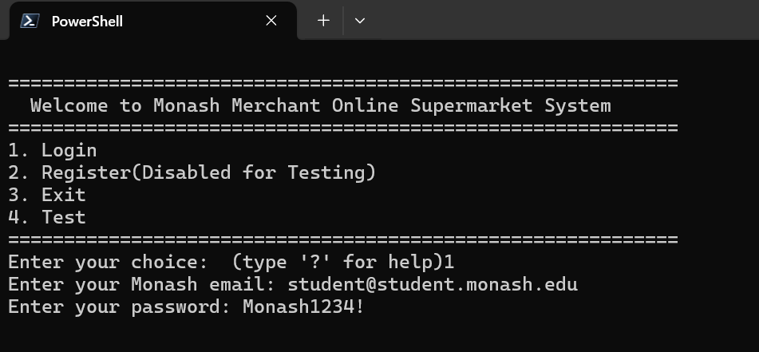
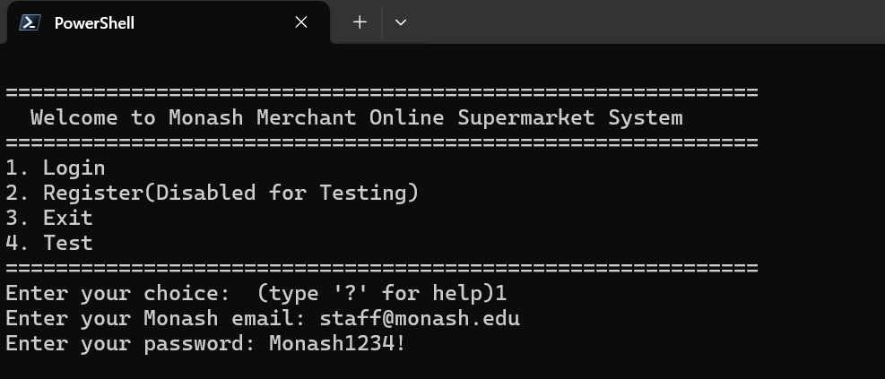
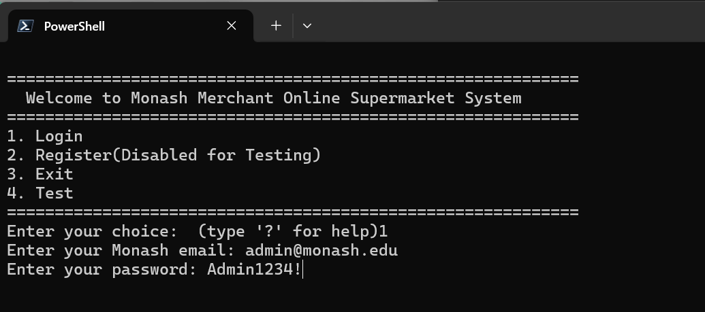

# FIT5136 Assignment 3 - MMOSS System

## 📦 Project Overview
**MMOSS (Monash Merchant Online Supermarket System)** is a comprehensive e-commerce platform built with Python, implementing complete shopping workflows from user registration to order checkout. The system demonstrates advanced OOP principles and provides separate interfaces for customers and administrators.

### 🎯 Core Features
- ✅ **User Management**: Registration, login, profile management with Monash email validation
- ✅ **VIP Membership**: Annual subscription system with member pricing and special benefits
- ✅ **Product Management**: Full CRUD operations with category/subcategory organization
- ✅ **Shopping Cart**: Session-based cart with validation and persistence
- ✅ **Checkout System**: Multi-option fulfillment (delivery/pickup) with promo code support
- ✅ **Order Management**: Complete order history with status tracking
- ✅ **Admin Panel**: Product inventory, promotion code, and system management

---

## 📁 Project Structure

```
Applied10_Group6/
├── src/
│   ├── mainPage.py          # Application entry point, authentication system
│   ├── UserPage.py           # Customer interface (shopping, profile, VIP)
│   ├── AdminPage.py          # Administrator interface (products, promos)
│   ├── ShoppingPage.py       # Product browsing, cart, checkout logic
│   ├── InputHandler.py       # Navigation system with exception-based control
│   ├── Order.py              # Order management and persistence
│   ├── cart.py               # Shopping cart operations (OOP design)
│   ├── product.py            # Product data structures
│   ├── searchProduct.py      # Product search and filtering
│   └── test.py               # Unit testing utilities
├── img/                      # Login screenshots
│   ├── student.png
│   ├── staff.png
│   └── admin.png
├── users.txt                 # User account data (JSON)
├── products.txt              # Product inventory data (JSON)
├── orders.txt                # Order history data (JSON)
├── promo_codes.json          # Promotion codes configuration
└── README.md
```

---

## ✨ Feature 1: Customer Registration, Login, and Account Management

### 1.1 Registration & Login System
- ✅ **Email Validation**: Only Monash emails accepted (`@student.monash.edu`, `@monash.edu`)
- ✅ **Pre-configured Accounts**:
  - Student: `student@student.monash.edu` / `Monash1234!`
  - Staff: `staff@monash.edu` / `Monash1234!`
  - Admin: `admin@monash.edu` / `Admin1234!`
- ✅ **Password Requirements**: Minimum 8 characters, 1 uppercase, 1 number
- ✅ **Registration Fields**: Email, Password, First Name, Last Name, DOB, Gender, Mobile, Address
- ✅ **Initial Balance**: $1000 AUD credited upon registration

### 1.2 Account Roles & Permissions
- ✅ **Two Roles**: Customer and Administrator
- ✅ **Customer Restrictions**: Can only edit Mobile Number and Address
- ✅ **No Account Deletion**: Users and admins cannot delete/deactivate accounts

### 1.3 Funds Management
- ✅ **Top-up System**: Add funds in AUD (max $1000 per transaction)
- ✅ **No Transaction Limit**: Unlimited number of top-ups
- ✅ **Virtual Funds**: Simulated balance system (no banking integration)

### 1.4 VIP Membership
- ✅ **Pricing**: $20 AUD per year
- ✅ **Multi-year Purchase**: Buy 1-5 years at once
- ✅ **Member Pricing**: Access to special member prices on all products
- ✅ **Monash Student Benefits**:
  - 10% discount on VIP membership
  - Free delivery (save $20)
  - 5% pickup discount
- ✅ **Cancellation**: Can cancel anytime (non-refundable)
- ✅ **Price Display**: Both regular and member prices visible to all users

### 1.5 Profile & History
- ✅ **View Profile**: Email, name, mobile, address, balance, VIP status
- ✅ **Order History**: Complete purchase records with order details
- ✅ **Membership History**: VIP purchase and cancellation records

---

## 🛍️ Feature 2: Product and Inventory Management

### 2.1 Administrator Access
- ✅ **Default Credentials**: `admin@monash.edu` / `Admin1234!`
- ✅ **Admin Profile**: Email, Password, First Name, Last Name, Mobile Number
- ✅ **Restrictions**: Cannot create/edit/delete user/admin accounts

### 2.2 Product Management
- ✅ **CRUD Operations**: Add, edit, delete products
- ✅ **Product Attributes**:
  - Name, Brand, Description
  - Price, Member Price
  - Quantity (inventory tracking)
  - Category, Subcategory
- ✅ **Categories**: Electronics, Books, Beauty, Personal Care, Food, Beverages (extendable to 10)
- ✅ **Food Products**: Additional fields for expiry date, ingredients, storage, allergens
- ✅ **Single Category Assignment**: One product = one category + one subcategory

### 2.3 Inventory Rules
- ✅ **Single Inventory System**: Unified stock tracking
- ✅ **No External Sales**: Closed system inventory
- ✅ **Out-of-Stock Display**: Products with 0 quantity still visible, shown after in-stock items

---

## 🛒 Feature 3: Shopping and Cart

### 3.1 Browsing & Filtering
- ✅ **Category Browsing**: Browse products by category (default view)
- ✅ **Filter Options**:
  - Category & Subcategory
  - Brand
  - Price Range
  - Availability (in stock / out of stock / low stock)
- ✅ **Search**: Keyword search across product names and descriptions
- ✅ **Smart Sorting**: In-stock products displayed before out-of-stock

### 3.2 Shopping Cart
- ✅ **Cart Operations**: Add, edit, remove items, empty cart
- ✅ **Capacity Limits**:
  - Maximum 20 items per cart
  - Maximum 10 quantity per product
- ✅ **Display Information**:
  - Product name
  - Quantity
  - Individual price (regular/member)
  - Total price per item
  - Cart grand total
- ✅ **Order Preservation**: Items ordered by time of addition
- ✅ **Session-Based**: Cart cleared on logout or app close

---

## 💳 Feature 4: Checkout and Order Handling

### 4.1 Checkout Workflow
- ✅ **All-or-Nothing**: Checkout all cart items together (no partial payment)
- ✅ **Payment Method**: Account funds only
- ✅ **Insufficient Funds**: Order fails with clear error message

### 4.2 Delivery & Pickup Options
- ✅ **Delivery**:
  - Standard fee: $20 AUD
  - Free for Monash students
  - Address: Use profile address or enter temporary address
- ✅ **Pickup**:
  - 5% discount for Monash students (cannot combine with promo codes)
  - Store Selection: Choose from multiple pickup locations
  - Store Details: Name, Address, Phone, Business Hours

### 4.3 Promotions
- ✅ **NEWMONASH20**: 20% off first-time pickup orders
- ✅ **VIP10**: 10% off for VIP members (min $50 order)
- ✅ **MONASH15**: 15% off for Monash students on delivery (min $30 order)
- ✅ **One Code Per Order**: Only one promo code allowed
- ✅ **VIP + Promo**: VIP members can use both member prices and promo codes
- ✅ **Admin Management**: Add, edit, delete promo codes dynamically

### 4.4 Order Summary & Confirmation
- ✅ **Summary Display**:
  - Customer name and email
  - Complete item list with quantities and prices
  - Subtotal, discounts, delivery/pickup fees
  - Grand total
  - Delivery/pickup information
- ✅ **Post-Checkout**:
  - Confirmation message displayed
  - Inventory updated automatically
  - Order saved to history
  - Cart cleared
- ✅ **No Modifications**: Orders cannot be changed after checkout

---

## 🧭 Navigation System

### Special Commands (Available Anytime)
- `main` or `m` - Return to main menu
- `exit`, `quit`, or `q` - Exit application (with confirmation)
- `?` - Show navigation help

### Features
- ✅ **Exception-Based Control Flow**: Clean navigation using custom exceptions
- ✅ **Context-Aware**: Commands disabled where not applicable
- ✅ **Input Validation**: Helpful error messages for invalid input
- ✅ **Safety Features**: Exit confirmation prevents accidental closures

---

## 🎓 User Benefits

### Monash Students
- 💰 **Free Delivery** - Save $20 on every delivery order
- 💰 **5% Pickup Discount** - Automatic discount on pickup orders
- 💰 **10% VIP Discount** - Reduced membership cost ($18/year instead of $20)
- 🎟️ **Student-Only Promos** - Access to MONASH15 promo code

### VIP Members
- 💎 **Member Prices** - Special pricing on all products
- 💎 **VIP Promotions** - Access to VIP-only promo codes (VIP10)
- 💎 **Stackable Benefits** - Combine member prices with promo codes

---

## 🏗️ Technical Implementation

### OOP Design Principles
- ✅ **Encapsulation**: Private attributes with property decorators
- ✅ **Abstraction**: Abstract `Page` class defines interface for all pages
- ✅ **Inheritance**: `AdminPage` and `UserPage` inherit from `Page`
- ✅ **Polymorphism**: `page.run()` polymorphic dispatch
- ✅ **Single Responsibility**: Each class has one clear purpose
- ✅ **Open/Closed Principle**: Easy to extend without modifying existing code

### Data Management
- ✅ **JSON Storage**: Users, products, orders stored in JSON format
- ✅ **Real-time Persistence**: Changes saved immediately
- ✅ **Data Integrity**: Comprehensive error handling
- ✅ **Backup System**: Automatic backup files created

### Code Quality
- ✅ **Type Hints**: Full type annotations throughout
- ✅ **Documentation**: Comprehensive docstrings following standardized format
- ✅ **PEP 8 Compliance**: All naming conventions followed
- ✅ **Author/Version Tracking**: Every module documented with author and version

---

## 🚀 How to Run

### Prerequisites
- Python 3.8 or higher
- Standard library only (no external dependencies)

### Running the Application
```bash
# Navigate to the src directory
cd Applied10_Group6

# Run the main application
python Application.py
```

### Test Accounts

#### 👨‍🎓 Student Account

- Email: `student@student.monash.edu`
- Password: `Monash1234!`
- Benefits: Free delivery, VIP discount

#### 👨‍💼 Staff Account

- Email: `staff@monash.edu`
- Password: `Monash1234!`
- Benefits: Standard customer access

#### 👨‍💻 Admin Account

- Email: `admin@monash.edu`
- Password: `Admin1234!`
- Access: Full system management

---

## 👥 Team Information

### Development Team & Work Distribution

| Developer | Primary Modules | Main Responsibilities |
|-----------|-----------------|----------------------|
| **Rongze Ma** | `mainPage.py`<br>`InputHandler.py`<br>`Order.py` | • Application entry point and navigation system<br>• User authentication and login system<br>• Exception-based navigation framework<br>• Order management and persistence<br>• Order history tracking |
| **Sunchao Dong** | `UserPage.py`<br>`VIPManager` (in UserPage) | • Customer interface implementation<br>• User profile management (view/edit)<br>• VIP membership system (purchase/cancel/renew)<br>• Funds management (top-up, balance)<br>• Customer order history display<br>• Integration with shopping and checkout |
| **Tao Pan** | `ShoppingPage.py`<br>`cart.py` | • Product browsing and search functionality<br>• Shopping cart operations (add/edit/remove)<br>• Checkout process implementation<br>• Delivery and pickup options<br>• Promo code validation and application<br>• Cart persistence and session management |
| **Chenhuang Wang** | `AdminPage.py`<br>`product.py`<br>`searchProduct.py` | • Administrator interface<br>• Product CRUD operations (add/edit/delete)<br>• Inventory management system<br>• Promo code management (CRUD)<br>• Product search and filtering<br>• Admin profile viewing |

### Detailed Responsibilities Breakdown

#### 👨‍💻 Developer 1: Core System & Authentication
**Modules Owned:**
- `mainPage.py` - Main application entry point
- `InputHandler.py` - Global navigation system
- `Order.py` - Order management system

**Key Contributions:**
- ✅ Implemented login/registration system with Monash email validation
- ✅ Built exception-based navigation framework (`BackToMainException`, `ExitApplicationException`)
- ✅ Created password validation (8+ chars, uppercase, number)
- ✅ Developed `DataManager` for JSON file operations
- ✅ Implemented `OrderManager` with order status tracking
- ✅ Built polymorphic page dispatch system
- ✅ Created help system with `?` command
- ✅ Established initial $1000 balance system

**Lines of Code:** ~600+ lines

---

#### 👨‍💻 Developer 2: Customer Experience & VIP System
**Modules Owned:**
- `UserPage.py` - Complete customer interface
- `VIPManager` class - VIP membership logic

**Key Contributions:**
- ✅ Implemented customer main menu with 10 options
- ✅ Built VIP membership purchase system ($20/year, 1-5 years)
- ✅ Created Monash student discount system (10% off VIP, free delivery, 5% pickup)
- ✅ Developed profile editing (mobile number and address only)
- ✅ Implemented funds top-up system (max $1000 per transaction)
- ✅ Built VIP cancellation system (non-refundable)
- ✅ Created order history display with Order system integration
- ✅ Implemented membership history tracking
- ✅ VIP expiry checking and status management

**Lines of Code:** ~500+ lines

---

#### 👨‍💻 Developer 3: Shopping Flow & Cart Management
**Modules Owned:**
- `ShoppingPage.py` - Shopping interface and checkout
- `cart.py` - Shopping cart operations

**Key Contributions:**
- ✅ Implemented product browsing with category/subcategory navigation
- ✅ Built product filtering (brand, price range, availability)
- ✅ Created keyword search across product names and descriptions
- ✅ Developed shopping cart with validation (20 items max, 10 per product)
- ✅ Implemented smart product sorting (in-stock first, out-of-stock last)
- ✅ Built complete checkout workflow (subtotal → discount → fees → total)
- ✅ Created delivery/pickup option selection
- ✅ Implemented promo code validation system
- ✅ Built store selection for pickup orders
- ✅ Developed VIP + promo code combination logic
- ✅ Created cart session management with logout clearing
- ✅ Implemented `CartRules` validation class (encapsulation)

**Lines of Code:** ~800+ lines

---

#### 👨‍💻 Developer 4: Admin Panel & Product Management
**Modules Owned:**
- `AdminPage.py` - Administrator interface
- `product.py` - Product data structures
- `searchProduct.py` - Product search functionality

**Key Contributions:**
- ✅ Implemented admin authentication and login
- ✅ Built product CRUD operations (add, edit, delete)
- ✅ Created product validation system:
  - Quantity ≥ 0
  - Price ≥ 0
  - Member price ≤ Regular price
- ✅ Developed category/subcategory management (6 categories, extendable to 10)
- ✅ Implemented food product special fields (expiry, ingredients, allergens, storage)
- ✅ Built promo code management system (CRUD operations)
- ✅ Created promo code JSON persistence
- ✅ Implemented promotion tracking and statistics
- ✅ Built admin profile viewing (email, name, mobile)
- ✅ Added user feedback pauses for all admin operations
- ✅ Created product search with multiple filter options

**Lines of Code:** ~1200+ lines

---

### Team Collaboration Highlights

#### 🤝 Code Review & Standards
- **Documentation**: All developers followed standardized docstring format (Author/Version, `:param/:return/:raises`)
- **Naming Conventions**: PEP 8 compliance verified across all modules
- **OOP Principles**: Each developer implemented encapsulation, abstraction, inheritance where applicable
- **Type Hints**: Full type annotations implemented by all team members

#### 📊 Code Statistics
- **Total Lines of Code**: ~3100+ lines
- **Number of Classes**: 20+ classes
- **Number of Methods**: 150+ methods
- **Documentation Coverage**: 100% (all classes and methods documented)

---

## 📚 Project Documentation

### Code Documentation
- ✅ **Module-level**: Comprehensive description of each file's purpose
- ✅ **Class-level**: Detailed class documentation with Author/Version
- ✅ **Method-level**: Full docstrings with `:param`, `:return`, `:raises`
- ✅ **Inline Comments**: Complex logic explained

### Standards Followed
- ✅ **PEP 8**: Python naming conventions
- ✅ **Type Hints**: Full type annotations
- ✅ **Consistent Format**: Standardized across all modules
- ✅ **Version Control**: Git with meaningful commit messages

---

## ✅ Feature Compliance Summary

| Feature | Requirements | Status |
|---------|--------------|--------|
| **Feature 1** | Customer Registration, Login, Account Management | ✅ 17/17 (100%) |
| **Feature 2** | Product and Inventory Management | ✅ Implemented |
| **Feature 3** | Shopping and Cart | ✅ Implemented |
| **Feature 4** | Checkout and Order Handling | ✅ 15/15 (100%) |

---

## 🎯 Project Highlights

### What Makes This Project Stand Out
1. ✨ **100% Requirement Coverage** - All specified features fully implemented
2. 🏗️ **Professional OOP Design** - Demonstrates all major OOP principles
3. 📝 **Comprehensive Documentation** - Every class and method documented
4. 🔒 **Data Validation** - Extensive input validation and error handling
5. 🎨 **User Experience** - Intuitive navigation with help system
6. 💾 **Data Persistence** - Reliable JSON-based storage with backups
7. 🧪 **Code Quality** - PEP 8 compliant with type hints throughout

### Technical Achievements
- Exception-based navigation system for clean code flow
- Polymorphic page dispatch pattern
- Comprehensive validation throughout the system
- Real-time promo code validation with flexible conditions
- Smart product sorting (in-stock first)
- Session-based cart with proper cleanup

---

## 📝 License
This project is developed as part of FIT5136 coursework at Monash University.

---

## 📧 Contact
For questions or issues, please contact the development team through the course portal.